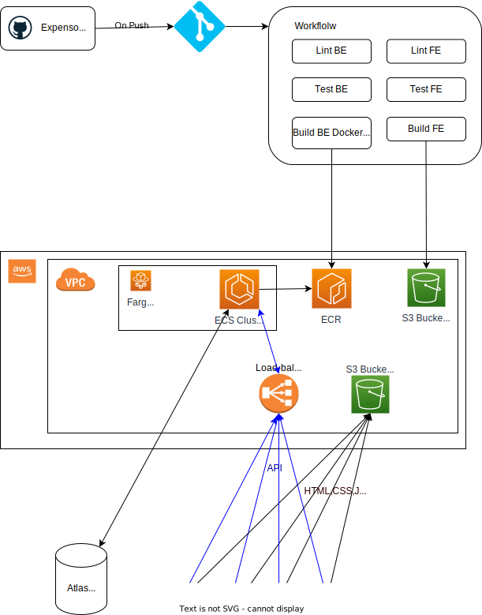

# Expenso - Web App to Keep Track of Expenses

## Application consist of:
  - **Back-End** (server code in folder **BE**) - written in **Node.js**
  - **Front-End** (UI code in folder **FE**) - written using **Ionic Framework** (Angular)
  - **Database** - (**MongoDB**) via a docker container image

## In order to run the app locally

  - Start the database via a docker container:
```shell
docker-compose -f docker-compose-mongo.yaml
```
  - Install all required packages and run the back-end:
```shell
cd BE/src
npm i
npm run dev
```
  - Install all required packages and run the front-end:
```
cd FE/expenso2.0/src
npm i
ionic serve
```


## To build the Docker Image of the app

  - Run:
```shell
docker build
```

## To start the app using the built image

  - Run:
```shell
docker-compose up
```

# Architecture Overview


